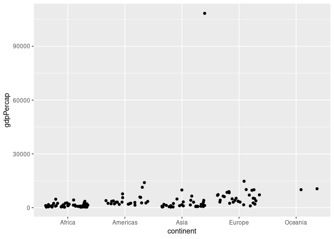
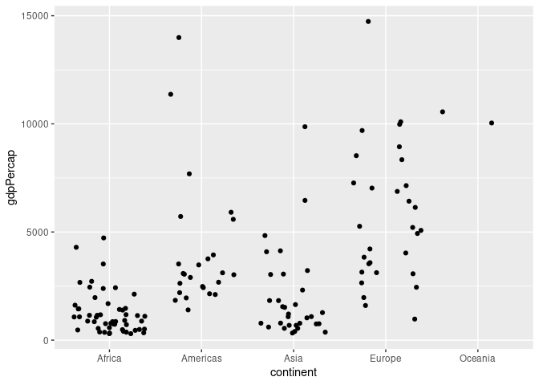
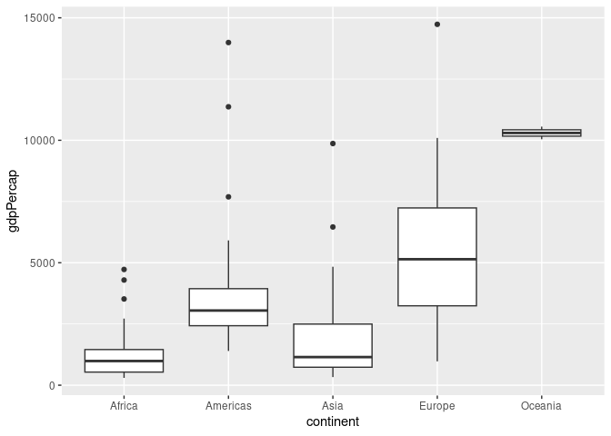
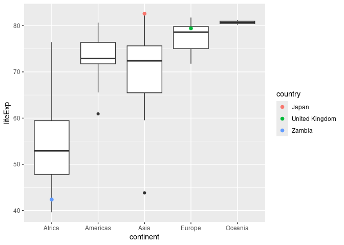
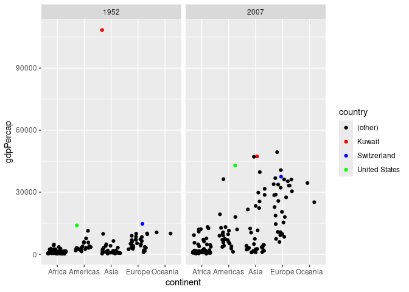
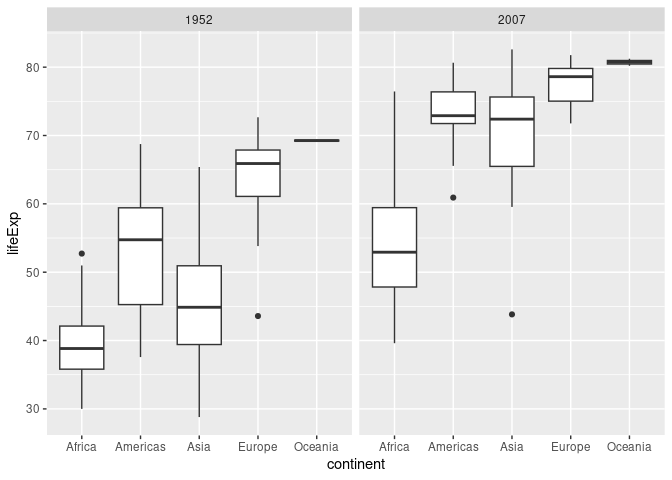
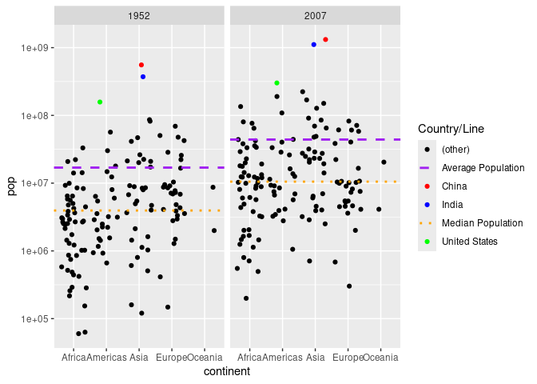
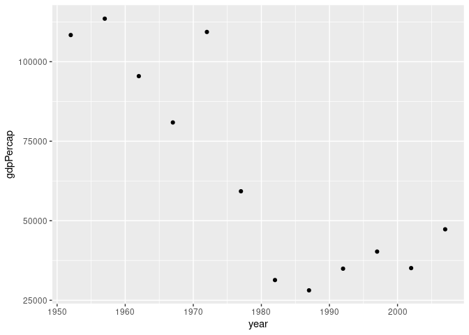

Gapminder
================
Maya Cranor
2025-

- [Grading Rubric](#grading-rubric)
  - [Individual](#individual)
  - [Submission](#submission)
- [Guided EDA](#guided-eda)
  - [**q0** Perform your “first checks” on the dataset. What variables
    are in
    this](#q0-perform-your-first-checks-on-the-dataset-what-variables-are-in-this)
  - [**q1** Determine the most and least recent years in the `gapminder`
    dataset.](#q1-determine-the-most-and-least-recent-years-in-the-gapminder-dataset)
  - [**q2** Filter on years matching `year_min`, and make a plot of the
    GDP per capita against continent. Choose an appropriate `geom_` to
    visualize the data. What observations can you
    make?](#q2-filter-on-years-matching-year_min-and-make-a-plot-of-the-gdp-per-capita-against-continent-choose-an-appropriate-geom_-to-visualize-the-data-what-observations-can-you-make)
  - [**q3** You should have found *at least* three outliers in q2 (but
    possibly many more!). Identify those outliers (figure out which
    countries they
    are).](#q3-you-should-have-found-at-least-three-outliers-in-q2-but-possibly-many-more-identify-those-outliers-figure-out-which-countries-they-are)
  - [**q4** Create a plot similar to yours from q2 studying both
    `year_min` and `year_max`. Find a way to highlight the outliers from
    q3 on your plot *in a way that lets you identify which country is
    which*. Compare the patterns between `year_min` and
    `year_max`.](#q4-create-a-plot-similar-to-yours-from-q2-studying-both-year_min-and-year_max-find-a-way-to-highlight-the-outliers-from-q3-on-your-plot-in-a-way-that-lets-you-identify-which-country-is-which-compare-the-patterns-between-year_min-and-year_max)
- [Your Own EDA](#your-own-eda)
  - [**q5** Create *at least* three new figures below. With each figure,
    try to pose new questions about the
    data.](#q5-create-at-least-three-new-figures-below-with-each-figure-try-to-pose-new-questions-about-the-data)

*Purpose*: Learning to do EDA well takes practice! In this challenge
you’ll further practice EDA by first completing a guided exploration,
then by conducting your own investigation. This challenge will also give
you a chance to use the wide variety of visual tools we’ve been
learning.

<!-- include-rubric -->

# Grading Rubric

<!-- -------------------------------------------------- -->

Unlike exercises, **challenges will be graded**. The following rubrics
define how you will be graded, both on an individual and team basis.

## Individual

<!-- ------------------------- -->

| Category | Needs Improvement | Satisfactory |
|----|----|----|
| Effort | Some task **q**’s left unattempted | All task **q**’s attempted |
| Observed | Did not document observations, or observations incorrect | Documented correct observations based on analysis |
| Supported | Some observations not clearly supported by analysis | All observations clearly supported by analysis (table, graph, etc.) |
| Assessed | Observations include claims not supported by the data, or reflect a level of certainty not warranted by the data | Observations are appropriately qualified by the quality & relevance of the data and (in)conclusiveness of the support |
| Specified | Uses the phrase “more data are necessary” without clarification | Any statement that “more data are necessary” specifies which *specific* data are needed to answer what *specific* question |
| Code Styled | Violations of the [style guide](https://style.tidyverse.org/) hinder readability | Code sufficiently close to the [style guide](https://style.tidyverse.org/) |

## Submission

<!-- ------------------------- -->

Make sure to commit both the challenge report (`report.md` file) and
supporting files (`report_files/` folder) when you are done! Then submit
a link to Canvas. **Your Challenge submission is not complete without
all files uploaded to GitHub.**

``` r
library(tidyverse)
```

    ## ── Attaching core tidyverse packages ──────────────────────── tidyverse 2.0.0 ──
    ## ✔ dplyr     1.1.4     ✔ readr     2.1.5
    ## ✔ forcats   1.0.0     ✔ stringr   1.5.1
    ## ✔ ggplot2   3.5.1     ✔ tibble    3.2.1
    ## ✔ lubridate 1.9.4     ✔ tidyr     1.3.1
    ## ✔ purrr     1.0.2     
    ## ── Conflicts ────────────────────────────────────────── tidyverse_conflicts() ──
    ## ✖ dplyr::filter() masks stats::filter()
    ## ✖ dplyr::lag()    masks stats::lag()
    ## ℹ Use the conflicted package (<http://conflicted.r-lib.org/>) to force all conflicts to become errors

``` r
library(gapminder)
```

*Background*: [Gapminder](https://www.gapminder.org/about-gapminder/) is
an independent organization that seeks to educate people about the state
of the world. They seek to counteract the worldview constructed by a
hype-driven media cycle, and promote a “fact-based worldview” by
focusing on data. The dataset we’ll study in this challenge is from
Gapminder.

# Guided EDA

<!-- -------------------------------------------------- -->

First, we’ll go through a round of *guided EDA*. Try to pay attention to
the high-level process we’re going through—after this guided round
you’ll be responsible for doing another cycle of EDA on your own!

### **q0** Perform your “first checks” on the dataset. What variables are in this

dataset?

``` r
## TASK: Do your "first checks" here!
glimpse(gapminder)
```

    ## Rows: 1,704
    ## Columns: 6
    ## $ country   <fct> "Afghanistan", "Afghanistan", "Afghanistan", "Afghanistan", …
    ## $ continent <fct> Asia, Asia, Asia, Asia, Asia, Asia, Asia, Asia, Asia, Asia, …
    ## $ year      <int> 1952, 1957, 1962, 1967, 1972, 1977, 1982, 1987, 1992, 1997, …
    ## $ lifeExp   <dbl> 28.801, 30.332, 31.997, 34.020, 36.088, 38.438, 39.854, 40.8…
    ## $ pop       <int> 8425333, 9240934, 10267083, 11537966, 13079460, 14880372, 12…
    ## $ gdpPercap <dbl> 779.4453, 820.8530, 853.1007, 836.1971, 739.9811, 786.1134, …

``` r
head(gapminder)
```

    ## # A tibble: 6 × 6
    ##   country     continent  year lifeExp      pop gdpPercap
    ##   <fct>       <fct>     <int>   <dbl>    <int>     <dbl>
    ## 1 Afghanistan Asia       1952    28.8  8425333      779.
    ## 2 Afghanistan Asia       1957    30.3  9240934      821.
    ## 3 Afghanistan Asia       1962    32.0 10267083      853.
    ## 4 Afghanistan Asia       1967    34.0 11537966      836.
    ## 5 Afghanistan Asia       1972    36.1 13079460      740.
    ## 6 Afghanistan Asia       1977    38.4 14880372      786.

**Observations**:

- Write all variable names here
- country: name of country on Earth
- continent: name of continent on Earth
- year: year
- lifeExp: average life expediency in years
- pop: population of the humans in the country
- gdpPercap: gross domestic product - a country’s economic output to a
  per-person outlook

### **q1** Determine the most and least recent years in the `gapminder` dataset.

*Hint*: Use the `pull()` function to get a vector out of a tibble.
(Rather than the `$` notation of base R.)

``` r
## TASK: Find the largest and smallest values of `year` in `gapminder`
year_max <- gapminder %>% pull(year) %>% max()
year_min <- gapminder %>% pull(year) %>% min()

year_max
```

    ## [1] 2007

``` r
year_min
```

    ## [1] 1952

Use the following test to check your work.

``` r
## NOTE: No need to change this
assertthat::assert_that(year_max %% 7 == 5)
```

    ## [1] TRUE

``` r
assertthat::assert_that(year_max %% 3 == 0)
```

    ## [1] TRUE

``` r
assertthat::assert_that(year_min %% 7 == 6)
```

    ## [1] TRUE

``` r
assertthat::assert_that(year_min %% 3 == 2)
```

    ## [1] TRUE

``` r
if (is_tibble(year_max)) {
  print("year_max is a tibble; try using `pull()` to get a vector")
  assertthat::assert_that(False)
}

print("Nice!")
```

    ## [1] "Nice!"

### **q2** Filter on years matching `year_min`, and make a plot of the GDP per capita against continent. Choose an appropriate `geom_` to visualize the data. What observations can you make?

You may encounter difficulties in visualizing these data; if so document
your challenges and attempt to produce the most informative visual you
can.

``` r
## TASK: Create a visual of gdpPercap vs continent
gapminder %>% 
  filter(year == 1952) %>% 
  ggplot(aes(x = continent , y = gdpPercap)) +
  geom_jitter(height=0)
```

<!-- -->

``` r
## removed the outlier to get a better look at the data
gapminder %>% 
  filter(year == 1952, gdpPercap < 90000) %>% 
  ggplot(aes(x = continent , y = gdpPercap)) +
  geom_jitter(height=0)
```

<!-- -->

``` r
gapminder %>% 
  filter(year == 1952,  gdpPercap < 90000) %>% 
  ggplot(aes(x = continent , y = gdpPercap)) +
 geom_boxplot()
```

<!-- -->

**Observations**:

- Africa has the lowest average gdpPercap without any breakaway
  outliers.
- Americas and Europe have the highest minimum gdpPercap, as their
  countries values are atleast above 2000.
- Americas has a clumping of countries between 2000-5000 gdpPercap, and
  a handful of countries with higher gdpPercap. Two of those countries
  have much higher gdpPercaps as they afe both above 10000
- Europe’s countries are evenly distrubted over a range of roughly 2000
  to 10000, with one outlier at 15000
- Oceania has the smallest amount of countries at 2, but they both have
  a fairly similar gdpPercap at roughly 10000.
- Asia has the widest range of values going from 700 to over 100,000
  gdpPercap. Most countries are near the 1000 gdpPercap, while there is
  one extreme outlier (Kuwait), which at least 7x bigger than other
  country.

**Difficulties & Approaches**:

- Write your challenges and your approach to solving them
- Asia has an extreme outlier, which changes the scale of the graph
  greatly, as it at least 7x bigger than every other value. To get a
  better look at the trends happening in the other countries, I filtered
  out the outlier. Once I did that, I was able to see what was
  happening!
- Another issue I had was that it was hard to see all the values plotted
  as a scatter plot since they were stacked on top of each other. To
  solve this, I used the jitter feature, which slightly shifts the
  points. Since the X-axis only had the continent, as long as the dot
  was still grouped together with its other continent dots, it didn’t
  need to be precisely on the line. This allowed me to see how many dots
  there were with similar values.

### **q3** You should have found *at least* three outliers in q2 (but possibly many more!). Identify those outliers (figure out which countries they are).

``` r
## TASK: Identify the outliers from q2
#highlight outliers?

gapminder %>%
  filter(year == 1952) %>%
  summarise(mean_gdp = mean(gdpPercap, na.rm = TRUE), median_gdp = median(gdpPercap, na.rm = TRUE))
```

    ## # A tibble: 1 × 2
    ##   mean_gdp median_gdp
    ##      <dbl>      <dbl>
    ## 1    3725.      1969.

``` r
gapminder %>% 
  glimpse() %>% 
  filter(year == 1952, gdpPercap > 13990)
```

    ## Rows: 1,704
    ## Columns: 6
    ## $ country   <fct> "Afghanistan", "Afghanistan", "Afghanistan", "Afghanistan", …
    ## $ continent <fct> Asia, Asia, Asia, Asia, Asia, Asia, Asia, Asia, Asia, Asia, …
    ## $ year      <int> 1952, 1957, 1962, 1967, 1972, 1977, 1982, 1987, 1992, 1997, …
    ## $ lifeExp   <dbl> 28.801, 30.332, 31.997, 34.020, 36.088, 38.438, 39.854, 40.8…
    ## $ pop       <int> 8425333, 9240934, 10267083, 11537966, 13079460, 14880372, 12…
    ## $ gdpPercap <dbl> 779.4453, 820.8530, 853.1007, 836.1971, 739.9811, 786.1134, …

    ## # A tibble: 3 × 6
    ##   country       continent  year lifeExp       pop gdpPercap
    ##   <fct>         <fct>     <int>   <dbl>     <int>     <dbl>
    ## 1 Kuwait        Asia       1952    55.6    160000   108382.
    ## 2 Switzerland   Europe     1952    69.6   4815000    14734.
    ## 3 United States Americas   1952    68.4 157553000    13990.

``` r
# gapminder %>%
#   glimpse() %>%
#   filter(year == 2007, gdpPercap > 37000)
```

**Observations**:

- Identify the outlier countries from q2
  - Outliers: Kuwait, Switzerland, United States
  - I picked these countries as outliers because they are the 3
    countries with highest gpdPercap. The mean gdpPercap of all
    countries is 3725.276 and the median is 1968.528, and Kuwait,
    Switzerland, United States gdpPercap are all above 13,000. Kuwait is
    an extreme outlier because it’s gpdPercap is 108382.35 which is more
    7 times bigger than Switzerland’s which is the next biggest country.

*Hint*: For the next task, it’s helpful to know a ggplot trick we’ll
learn in an upcoming exercise: You can use the `data` argument inside
any `geom_*` to modify the data that will be plotted *by that geom
only*. For instance, you can use this trick to filter a set of points to
label:

``` r
## NOTE: No need to edit, use ideas from this in q4 below
gapminder %>%
  filter(year == max(year)) %>%

  ggplot(aes(continent, lifeExp)) +
  geom_boxplot() +
  geom_point(
    data = . %>% filter(country %in% c("United Kingdom", "Japan", "Zambia")),
    mapping = aes(color = country),
    size = 2
  )
```

<!-- -->

### **q4** Create a plot similar to yours from q2 studying both `year_min` and `year_max`. Find a way to highlight the outliers from q3 on your plot *in a way that lets you identify which country is which*. Compare the patterns between `year_min` and `year_max`.

*Hint*: We’ve learned a lot of different ways to show multiple
variables; think about using different aesthetics or facets.

``` r
## TASK: Create a visual of gdpPercap vs continent
# For the year 1952
gapminder %>% 
  filter(year == 1952 | year == 2007) %>% 
  ggplot(aes(x = continent , y = gdpPercap)) +
  geom_jitter(height=0,
              width=.35,
    data = . %>% 
      mutate(
        country = case_when(
          country %in% c("Kuwait", "Switzerland", "United States") ~ country,
          TRUE ~ "(other)"
          )
      ),
    mapping = aes(color = country)
  ) +
  scale_color_manual(
    values = c(
      "(other)" = "black",
      "Kuwait" = "red",
      "Switzerland" = "blue",
      "United States" = "green"
    )
  ) +
  facet_wrap(~ year)
```

<!-- -->

**Observations**:

- Overall lots of countries have increased their gdpPercap, this is
  likely due to a multitude of factors including inflation and
  productivity increases that started in the 1950s. The productivity
  increases were caused by technological advances, and increased
  automation. (<https://www.bls.gov/opub/mlr/1993/11/art1full.pdf>)
- Kuwait has dramatically decreased its gpdPercap from 108382.35 to
  47306.99, and is no longer an extreme outlier as it no longer has the
  highest gpdPercap and there are several countries with similar values.
- US remains country with the highest gpdPercap in the Americas. It’s
  gpdPercap has increased from 13990.48 to 42951.65.
- Switzerland has the 2nd highest gpdPercap of all the countries or the
  highest of Europe. However, it still has a relatively high gpdPercap
  as its not the 7th highest country. It’s gpdPercap has increased from
  14734.23 to 37506.42

# Your Own EDA

<!-- -------------------------------------------------- -->

Now it’s your turn! We just went through guided EDA considering the GDP
per capita at two time points. You can continue looking at outliers,
consider different years, repeat the exercise with `lifeExp`, consider
the relationship between variables, or something else entirely.

### **q5** Create *at least* three new figures below. With each figure, try to pose new questions about the data.

``` r
## TASK: Your first graph
gapminder %>% 
  filter(year == 1952 | year == 2007 ) %>% 
  ggplot(aes(x = continent , y = lifeExp)) +
  geom_boxplot() +
  facet_wrap(~ year)
```

<!-- -->

- Graph shows the life expediencies in 1952 and 2007 of all countries.
- The life expediency in every continent generally has increased.
- The median order of life expediency has retained the same order
  relative to all of the continents, with Africa having the lowest life
  expediency and Oceania having the highest.
- Asia had the biggest increase in life expediency, as it’s median in
  1952 was around 45 and in 2007 it was around 73. It also much closer
  to Americas and Europe’s median life expediency, instead of Africa’s.

``` r
## TASK: Your second graph
gapminder %>% 
  filter(year == 1952 | year == 2007) %>% 
  ggplot(aes(x = continent , y = pop)) +
  geom_jitter( height=0,
    data = . %>% 
      mutate(
        country = case_when(
          country %in% c("China", "India", "United States") ~ country,
          TRUE ~ "(other)"
        )
      ),
    mapping = aes(color = country)
  ) +
  geom_hline(
    data = . %>% group_by(year) %>% summarise(avg_pop = mean(pop, na.rm = TRUE)),
    aes(yintercept = avg_pop, color = "Average Population"),
    linetype = "dashed",
    size = 1
  ) +
  geom_hline(
    data = . %>% group_by(year) %>% summarise(median_pop = median(pop, na.rm = TRUE)),
    aes(yintercept = median_pop, color = "Median Population"),
    linetype = "dotted",
    size = 1
  ) +
  scale_color_manual(
    values = c(
      "(other)" = "black",
      "China" = "red",
      "India" = "blue",
      "United States" = "green",
      "Average Population" = "purple",
      "Median Population" = "orange"
    )
  ) +
  facet_wrap(~ year) +
  scale_y_log10() +
  labs(color = "Country/Line")
```

    ## Warning: Using `size` aesthetic for lines was deprecated in ggplot2 3.4.0.
    ## ℹ Please use `linewidth` instead.
    ## This warning is displayed once every 8 hours.
    ## Call `lifecycle::last_lifecycle_warnings()` to see where this warning was
    ## generated.

<!-- -->

- Graph shows the population size in 1952 and 2007 of all countries.
- Overall there seems to be an increase in population of all countries
  as the average and median population both increased.
- China, India, United States have the biggest populations (in that
  order) in both 1952 and 2007. They also increased greatly from 1952 to
  2007.

``` r
## TASK: Your third graph
gapminder %>% 
  filter(country == "Kuwait" ) %>% 
  ggplot(aes(x = year , y = gdpPercap)) +
  geom_point()
```

<!-- -->

- Graph shows the gpdPercap in Kuwait from 1950 to 2007
- After 1960 there is a decrease in gdpPercap, which continues to
  plummit until 1990s
  - Either the population or general wealth changes drastically over
    this time period
